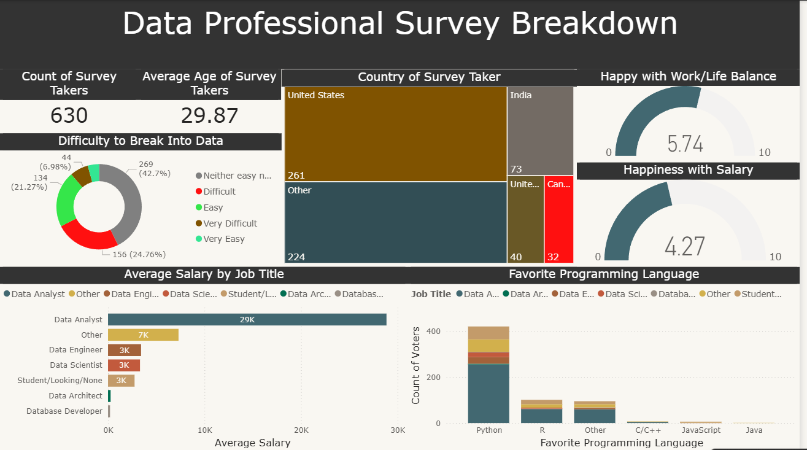

# 📊 Data Professional Survey Breakdown (Power BI)

## 📌 Project Overview
This project analyzes a real-world survey of data professionals using Power BI.  
The goal is to explore trends in salaries, job roles, programming languages, and work satisfaction.

---

## 📂 Dataset
- Source: Data Professional Survey
- Records: 630 responses
- Features include:
  - Job Title
  - Salary
  - Country
  - Programming Language
  - Work/Life Balance
  - Salary Satisfaction

---

## ⚙️ Data Processing (Power Query)
- Removed unnecessary columns
- Split columns into meaningful attributes
- Replaced missing/incorrect values
- Created a new column for **Average Salary**

---

## 📊 Dashboard Features
- KPI Cards:
  - Total Survey Participants
  - Average Age
- Salary Analysis:
  - Average Salary by Job Title
- Programming Insights:
  - Favorite Programming Languages
- Geographic Distribution:
  - Treemap by Country
- Satisfaction Metrics:
  - Work/Life Balance (Gauge)
  - Salary Satisfaction (Gauge)
- Entry Difficulty into Data Field (Donut Chart)

---

## 📸 Dashboard Preview

---

## 🚀 Tools Used
- Power BI
- Power Query
- Data Cleaning & Transformation

---

## 📈 Key Insights
- Data Analysts dominate the survey sample
- Python is the most popular programming language
- Salary satisfaction is lower than work-life balance satisfaction
- Most respondents find entering the data field moderately difficult

---

## 👤 Author
Anastasios Saliaris
